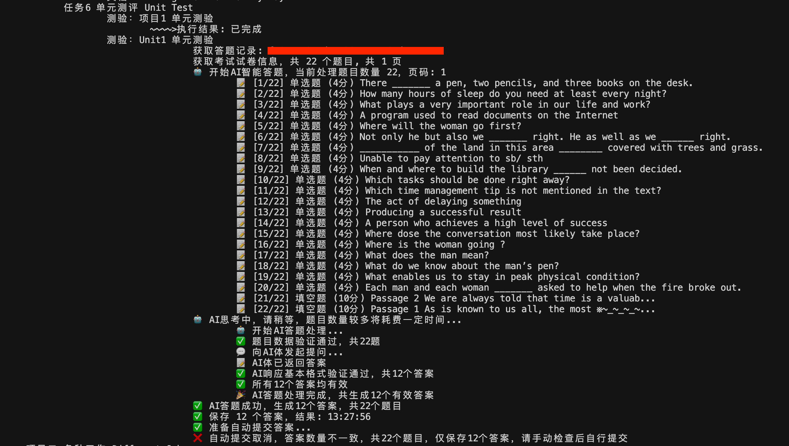

# MOOC 智慧职教助手

[](https://github.com/11273/mooc-work-answer)
[](https://github.com/11273/mooc-work-answer)
[](https://github.com/11273/mooc-work-answer/issues)
[](https://github.com/11273/mooc-work-answer/releases)

> 🎓 智慧职教平台学习管理工具，通过官方 API 接口实现学习进度跟踪与辅助功能

## ✨ 特色功能

### 🤖 AI 学习辅助`DeepSeek`

- **v3.0 新增功能**：集成 AI 学习辅助系统
- **参考准确率**：60-100%（仅供学习参考）
- **适用场景**：日常学习、练习辅助
- **注意事项**：重要评估建议人工验证

### 📚 多平台支持

| 平台            | 地址                                                                                  | 支持功能                    | 状态      |
| --------------- | ------------------------------------------------------------------------------------- | --------------------------- | --------- |
| 智慧职教-MOOC   | [icve-mooc.icve.com.cn](https://icve-mooc.icve.com.cn)                                | 学习管理、讨论、AI 学习辅助 | ✅ 运行中 |
| 智慧职教-课堂版 | [user.icve.com.cn](https://user.icve.com.cn/learning/u/student/teaching/index.action) | 学习管理、讨论              | ✅ 运行中 |
| 智慧职教-资源库 | [zyk.icve.com.cn](https://zyk.icve.com.cn/)                                           | 学习管理                    | ✅ 运行中 |
| 智慧职教-旧版   | [mooc-old.icve.com.cn](https://mooc-old.icve.com.cn)                                  | 学习管理、测验、考试、作业  | ⚠️ 已停用 |

### 🔧 核心功能

| 功能类型        | 智慧职教版 | 职教云版 | 功能描述                       | 状态   |
| --------------- | ---------- | -------- | ------------------------------ | ------ |
| 📖 **学习管理** | ✅         | ✅       | 通过 API 接口管理课程学习进度  | 已完成 |
| 💬 **讨论辅助** | ✅         | ❌       | 辅助参与课程讨论，提供回复建议 | 已完成 |
| 📝 **学习辅助** | ✅         | ❌       | AI 驱动的学习内容理解与分析    | 已完成 |
| 📋 **作业辅助** | 🔄         | ✅       | 辅助完成课程作业，提供解题思路 | 开发中 |
| 🎯 **评估辅助** | 🔄         | ❌       | 在线评估辅助功能，提供参考答案 | 规划中 |

**版本说明**：

- **智慧职教版**：支持 MOOC、课堂版、资源库等多个平台
- **职教云版**：专门针对职教云平台优化 - [前往项目 >>>](https://github.com/11273/zjy-work-answer)

## 🚀 快速开始

### 💾 下载安装

#### 方式一：直接运行（推荐新手）

1. 前往 [Releases](https://github.com/11273/mooc-work-answer/releases/latest) 下载最新版本
2. 解压后直接运行 `.exe` 文件
3. 按照提示进行配置即可

#### 方式二：源码运行（开发者）

```bash
# 1. 克隆项目
git clone https://github.com/11273/mooc-work-answer.git
cd mooc-work-answer

# 2. 安装依赖
pip install -i https://pypi.tuna.tsinghua.edu.cn/simple -r requirements.txt

# 3. 运行程序
python StartWork.py
```

### 🔧 环境要求

- **Python**: 3.6 ≤ version < 3.9
- **操作系统**: Windows / macOS / Linux
- **网络**: 稳定的互联网连接

## ⚙️ 技术说明

### 🔍 技术原理

- 通过调用智慧职教官方 API 接口进行数据交互
- 单线程运行，确保操作时间控制在合理范围
- 已在 38+ 课程中进行兼容性测试

### 🛡️ 安全机制

- 遵循正常用户操作节奏
- 合理的随机时间间隔设置
- 单线程运行，降低系统负载

## 📖 使用指南

### 📋 操作步骤

1. **启动程序**: 运行 `StartWork.py` 或下载的可执行文件
2. **登录账号**: 输入智慧职教账号密码
3. **选择功能**: 根据需要选择学习管理、辅助功能等
4. **程序执行**: 程序通过 API 接口辅助完成相关任务
5. **查看结果**: 实时显示执行进度和结果

### 💡 使用技巧

- 建议在网络稳定的环境下使用
- 可同时开启多个不同平台的任务
- 定期更新到最新版本以获得最佳体验

## ⚠️ 重要声明

### 📢 免责声明

- **学习用途**: 本项目仅供技术学习和研究使用，严禁用于商业盈利
- **AI 参考性**: AI 学习辅助准确率约 60-100%，重要评估请人工验证
- **使用责任**: 用户应自行承担使用本工具的所有责任和风险
- **合规使用**: 请严格遵守相关平台的使用条款和服务协议
- **技术性质**: 本项目为学习管理工具，通过合法 API 接口进行数据交互

### 🚫 禁止行为

- 商业化使用或销售
- 大规模批量操作
- 破坏平台正常秩序
- 侵犯他人权益

## 🆘 问题反馈

### 🐛 Bug 报告

在提交问题前，请确保：

- 提供详细的错误信息
- 说明出错的具体代码行
- 描述重现问题的步骤

**提交方式**：

- [Issues](https://github.com/11273/mooc-work-answer/issues/new) - 提交 Bug 和建议
- [Discussions](https://github.com/11273/mooc-work-answer/discussions) - 讨论交流

### 📚 参考资料

- [API 接口技术详解](https://www.52pojie.cn/thread-1338063-1-1.html)
- [网关认证技术](https://www.52pojie.cn/thread-1713942-1-1.html)
- [新手运行教程](REAEME_RUN.md)

## 🎯 相关项目

- **职教云版本**: [zjy-work-answer](https://github.com/11273/zjy-work-answer) - 专门针对职教云平台

## 📊 项目统计

[](https://github.com/11273/mooc-work-answer)

## 🖼️ 效果展示

> 注：随着版本迭代，实际界面可能与下图有所差异，请以最新版本为准

<details>
<summary>点击查看截图</summary>




</details>

---

<div align="center">

**⭐ 如果这个项目对你有帮助，请给一个 Star 支持！**

**📢 欢迎 Fork 和提交 Pull Request 来改进项目！**

</div>
