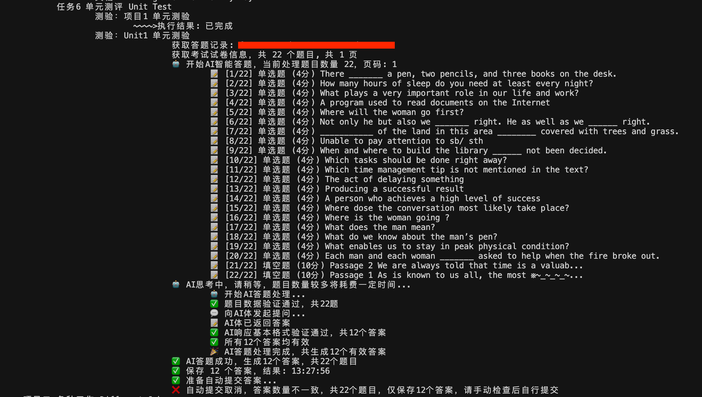
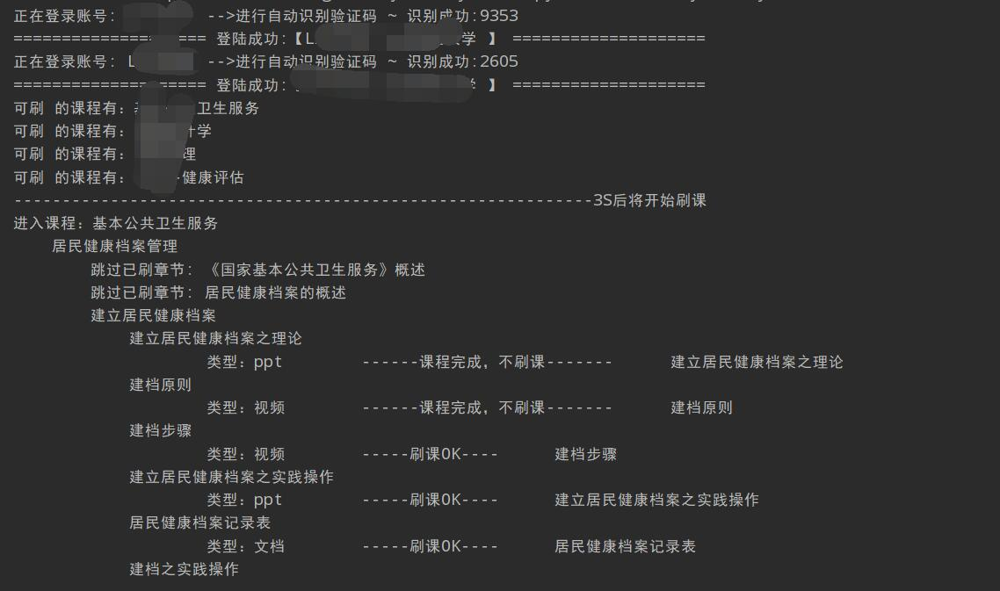
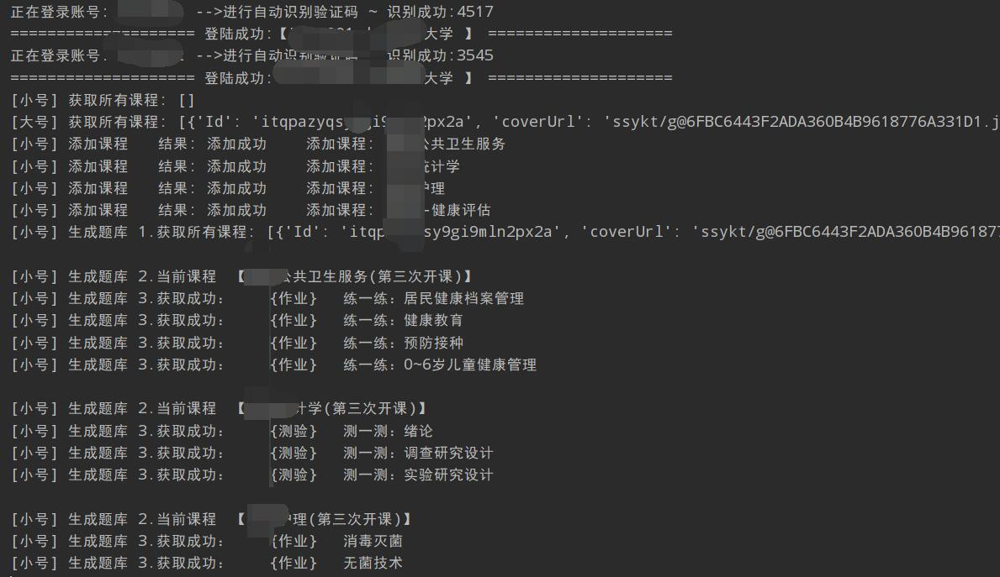
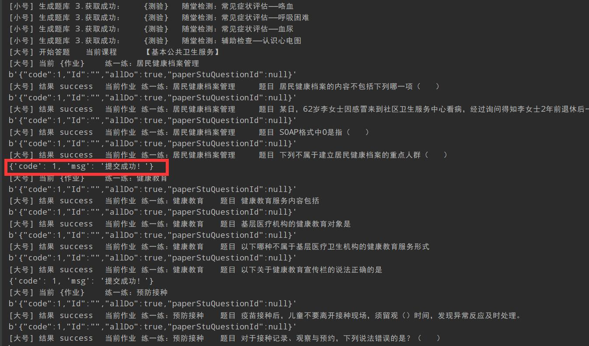
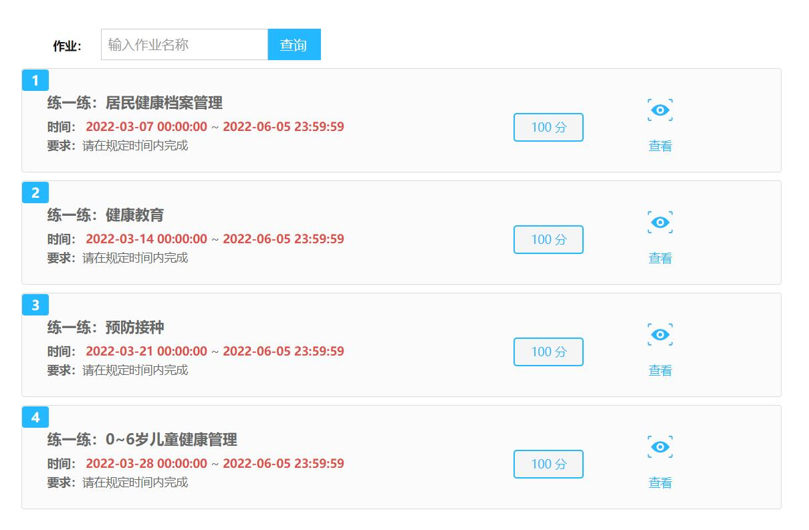
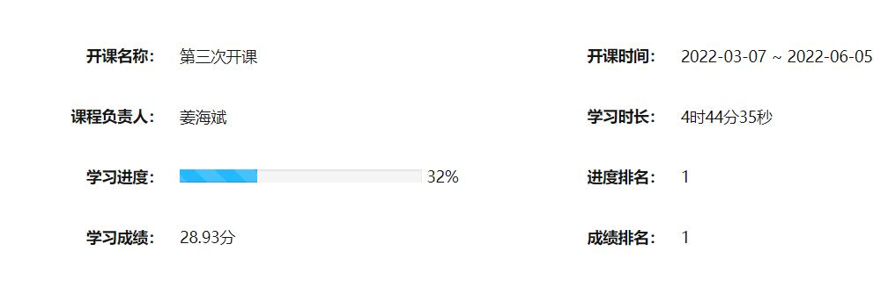
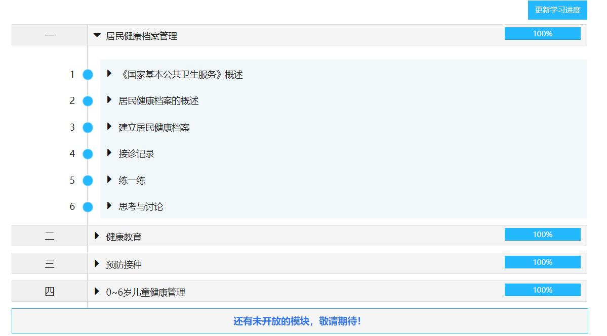

# MOOC 智慧职教助手

[](https://github.com/11273/mooc-work-answer)
[](https://github.com/11273/mooc-work-answer)
[](https://github.com/11273/mooc-work-answer/issues)
[](https://github.com/11273/mooc-work-answer/releases)

> 🎓 智慧职教平台学习管理工具，通过官方 API 接口实现学习进度跟踪与辅助功能

## ✨ 特色功能

### 🤖 AI 学习辅助`DeepSeek`

- **v3.0 新增功能**：集成 AI 学习辅助系统
- **参考准确率**：60-100%（仅供学习参考）
- **适用场景**：日常学习、练习辅助
- **注意事项**：重要评估建议人工验证

### 📚 多平台支持

| 平台 | 地址                                                     | 说明 | 状态 |
| :--- |:-------------------------------------------------------| :--- | :--- |
| **职教云** | **[前往项目仓库](https://github.com/11273/zjy-work-answer)** | 职教云平台请使用专用版本 | ✅ 运行中 |
| **常规 MOOC** / **AI 优课** | [ai.icve.com.cn](https://ai.icve.com.cn/)              | 支持学习管理、题目导出、AI 辅助等功能 | ✅ 运行中 |
| **资源库** | [zyk.icve.com.cn](https://zyk.icve.com.cn/)            | 支持学习管理功能 | ✅ 运行中 |
| ~~智慧职教-课堂版~~ | -                                                      | 已停止支持 | ❌ 已下架 |
| ~~智慧职教-旧版~~ | -                                                      | 已停止支持 | ❌ 已下架 |

### 🔧 核心功能

| 功能类型        | 智慧职教版 | 职教云版 | 功能描述                       | 状态   |
| --------------- | ---------- | -------- | ------------------------------ | ------ |
| 📖 **学习管理** | ✅         | ✅       | 通过 API 接口管理课程学习进度  | 已完成 |
| 💬 **讨论辅助** | ✅         | ❌       | 辅助参与课程讨论，提供回复建议 | 已完成 |
| 📝 **学习辅助** | ✅         | ❌       | AI 驱动的学习内容理解与分析    | 已完成 |
| 📤 **题目导出** | ✅         | ❌       | 导出作业/测验/考试题干与正确答案| 已完成 |
| 📋 **作业辅助** | 🔄         | ✅       | 辅助完成课程作业，提供解题思路 | 开发中 |
| 🎯 **评估辅助** | 🔄         | ❌       | 在线评估辅助功能，提供参考答案 | 规划中 |

**版本说明**：

- **智慧职教版**：支持 MOOC、AI 优课、资源库等平台
- **职教云版**：专门针对职教云平台优化 - [前往项目 >>>](https://github.com/11273/zjy-work-answer)

## 🚀 快速开始

### 💾 下载安装

#### 方式一：直接运行（推荐新手）

1. 前往 [Releases](https://github.com/11273/mooc-work-answer/releases/latest) 下载最新版本
2. 解压后直接运行 `.exe` 文件
3. 按照提示进行配置即可

#### 方式二：源码运行（开发者）

```bash
# 1. 克隆项目
git clone https://github.com/11273/mooc-work-answer.git
cd mooc-work-answer

# 2. 安装依赖
pip install -i https://pypi.tuna.tsinghua.edu.cn/simple -r requirements.txt

# 3. 运行程序
python StartWork.py
```

# 3. 运行开发模式（可选）

```bash 
python StartWork.py -dev
```


### 🔧 环境要求

- **Python**: ≥ 3.8
- **操作系统**: Windows / macOS / Linux
- **网络**: 稳定的互联网连接

## ⚙️ 技术说明

### 🔍 技术原理

- 通过调用智慧职教官方 API 接口进行数据交互
- 单线程运行，确保操作时间控制在合理范围
- 已在 38+ 课程中进行兼容性测试

### 🛡️ 安全机制

- 遵循正常用户操作节奏
- 合理的随机时间间隔设置
- 单线程运行，降低系统负载

## 📖 使用指南

### 📋 操作步骤

1. **启动程序**: 运行 `StartWork.py` 或下载的可执行文件
2. **登录账号**: 浏览器 OAuth 完成登录
3. **选择功能**:
   - 学习管理（刷课/进度）
   - 导出题目（作业/测验/考试，含正确答案）：选择课程 → 选择格式（md/word）→ 确认是否写入我的答案 → 选择范围 →（测验）选择导出模式
4. **程序执行**: 程序通过 API 接口辅助完成相关任务
5. **查看结果**: 实时显示执行进度；题目导出结果在 `tiku/<课程名>/`

### 📤 题目导出说明

- **适用平台**: 常规 MOOC / AI 优课（`ai.icve.com.cn`）
- **导出内容**: 题干、选项（正确项加粗）、正确答案、解析；判断题答案为「正确 / 错误」
- **我的答案**: 默认**不写入**文档；导出时 `导出文档写入我的答案 [y/n]` 选 `y` 才追加（取自已交卷作答记录）
- **选择流程**:
  1. 列出全部课程，多选要导出的课程（`all` / `1,3` / `1-3`）
  2. 选择导出格式：Markdown / Word（.docx）/ 两者
  3. 确认是否写入我的答案（默认 n）
  4. 选择导出范围：作业 / 考试 / 测验 / 全部
  5. 范围含测验时，选择导出模式：
     - **单个/多个章节测验**：手动选择要导出的测验
     - **所有章节测验（每个章节一个文件）**
     - **所有章节测验（所有章节一个文件 / 合并）**
- **输出格式**: `tiku/<课程名>/` 下 `.md` 和/或 `.docx`；
- **Word 排版**: 微软雅黑；第 1 页封面、第 2 页目录、正文页码从 1 起、章节奇数页起、题目不跨页
- **开发模式**: `python StartWork.py -dev` 时控制台保留 `[时间戳] ::` 日志，并额外写试卷 `.json`、`raw/` 与根目录 `tiku/summary.*`；正式模式控制台无时间戳前缀
- **注意**:
  - `GET paper` 可能创建作答记录，导出即请求
  - 我的答案仅在已交卷记录中存在；未交卷的测验没有我的答案
  - `-dev` 的 `raw/` 可能含姓名/学号，请勿公开分享

### 💡 使用技巧

- 建议在网络稳定的环境下使用
- 可同时开启多个不同平台的任务
- 定期更新到最新版本以获得最佳体验

## ⚠️ 重要声明

### 📢 免责声明

- **学习用途**: 本项目仅供技术学习和研究使用，严禁用于商业盈利
- **AI 参考性**: AI 学习辅助准确率约 60-100%，重要评估请人工验证
- **使用责任**: 用户应自行承担使用本工具的所有责任和风险
- **合规使用**: 请严格遵守相关平台的使用条款和服务协议
- **技术性质**: 本项目为学习管理工具，通过合法 API 接口进行数据交互

### 🚫 禁止行为

- 商业化使用或销售
- 大规模批量操作
- 破坏平台正常秩序
- 侵犯他人权益

## 🆘 问题反馈

### 🐛 Bug 报告

在提交问题前，请确保：

- 提供详细的错误信息
- 说明出错的具体代码行
- 描述重现问题的步骤

**提交方式**：

- [Issues](https://github.com/11273/mooc-work-answer/issues/new) - 提交 Bug 和建议
- [Discussions](https://github.com/11273/mooc-work-answer/discussions) - 讨论交流

### 📚 参考资料

- [API 接口技术详解](https://www.52pojie.cn/thread-1338063-1-1.html)
- [网关认证技术](https://www.52pojie.cn/thread-1713942-1-1.html)
- [新手运行教程](REAEME_RUN.md)

## 🎯 相关项目

- **职教云版本**: [zjy-work-answer](https://github.com/11273/zjy-work-answer) - 专门针对职教云平台

## 📊 项目统计

[](https://github.com/11273/mooc-work-answer)

## 🖼️ 效果展示

> 注：随着版本迭代，实际界面可能与下图有所差异，请以最新版本为准

<details>
<summary>点击查看截图</summary>















</details>

---

<div align="center">

**⭐ 如果这个项目对你有帮助，请给一个 Star 支持！**

**📢 欢迎 Fork 和提交 Pull Request 来改进项目！**

</div>
