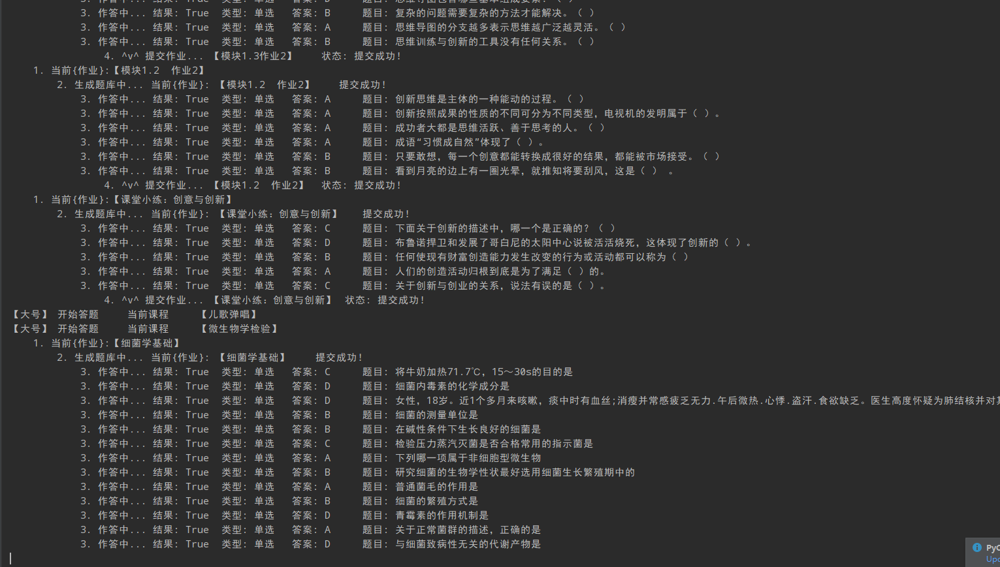

# mooc-work-answer

[](https://github.com/11273/mooc-work-answer)
[](https://github.com/11273/mooc-work-answer)
[](https://github.com/11273/mooc-work-answer/issues)
[](https://github.com/11273/mooc-work-answer/releases)
<!-- [](https://github.com/11273/mooc-work-answer) -->

|                              项目                               |                                     适用网站                                      |     功能      |
|:-------------------------------------------------------------:|:-----------------------------------------------------------------------------:|:-----------:|
| [mooc-work-answer](https://github.com/11273/mooc-work-answer) |                                                                               |             |
|                                                               |                    [智慧职教-旧版](https://mooc-old.icve.com.cn)                    | 刷课、测验、考试、作业 |
|                                                               |                   [智慧职教-新版](https://icve-mooc.icve.com.cn)                    |    刷课、讨论    |
|                                                               | [智慧职教-课堂版](https://user.icve.com.cn/learning/u/student/teaching/index.action) |    刷课、讨论    |
|                                                               |                     [智慧职教-资源库](https://zyk.icve.com.cn/)                      |     刷课      |
|  [zjy-work-answer](https://github.com/11273/zjy-work-answer)  |                                                                               |             |
|                                                               |                  [职教云](https://zjy2.icve.com.cn/study/index)                  |     刷课      |

- **智慧职教 旧版【考试 + 测验 + 作业 + 刷课】+ 新版【刷课】**
  <https://user.icve.com.cn/learning/u/student/teaching/index.action>
- **职教云 请前往 [zjy-work-answer >>>](https://github.com/11273/zjy-work-answer)**

- **仅适用于: <https://mooc-old.icve.com.cn> 以及 <https://icve-mooc.icve.com.cn/>**

- **详细刷课技术参考** [刷课技术篇>>>](https://www.52pojie.cn/thread-1338063-1-1.html)

- **网关认证技术参考** [网关认证技术篇>>>](https://www.52pojie.cn/thread-1713942-1-1.html)

  ***

## 🎄 公告 🎄

**重要声明：该项目仅供用于学习目的，鼓励学生更高效地管理和完成在线课程，严禁将其用于盈利目的。**

> - 🎉 之前出现的 **[网关扫码](http://u6e.cn/dnDP0)** 提供教程学习 **[点击前往>>>](https://www.52pojie.cn/thread-1713942-1-1.html)**
> - 📢 直接运行请前往下载已打包版本 **[点击前往>>>](https://github.com/11273/mooc-work-answer/releases)**
> - 📣 讨论请前往 Discussions **[点击前往>>>](https://github.com/11273/mooc-work-answer/discussions)**
> - 📣 提交问题请前往 Issues **[点击前往>>>](https://github.com/11273/mooc-work-answer/issues)**

- **[新手运行此项目前往 >](REAEME_RUN.md)**

## 下载

- 最新版下载 [Download exe 绿色运行版 >>>](https://github.com/11273/mooc-work-answer/releases/tag/v2.2.0)
- 历史版本下载[请前往>>>](https://github.com/11273/mooc-work-answer/releases)

## 实现功能

| 版本   | 功能 | 介绍 | 完成 |
|------|:--:|:--:|:--:|
| 新版 ↓ |    |    |    |
|      | 刷课 | 完成 | ✅  |
|      | 讨论 | 完成 | ✅  |
| 旧版 ↓ |    |    |    |
|      | 刷课 | 完成 | ✅  |
|      | 测验 | 完成 | ✅  |
|      | 考试 | 完成 | ✅  |
|      | 作业 | 完成 | ✅  |

## 运行环境

- python ≥ 3.6 < 3.9 (3.9 部分用户安装不了 Pillow 库)
- 运行所需 pip 包请自行切换到本项目根目录使用以下命令进行安装

  ```pip
   pip install -i https://pypi.tuna.tsinghua.edu.cn/simple -r requirements.txt
  ```

## 技术简述(旧版)

- 功能部分都是调用 mooc 的 api 模拟行为，当前已连续测试课程数 38，测试成功，项目单线程运行，刷课、作答时间可控，非必要请勿修改
- 答题时间： **300-1000** 秒区间内随机
- 刷课时间：比原课件时长多 **20-100** 秒区间内随机

## 使用方法

### 开发者运行

1. 运行 `StartWork.py`
2. 根据提示进行输入配置即可

### 个人运行

1. [前往下载最新版>>>](https://github.com/11273/mooc-work-answer/releases) 下载后点击运行
2. 根据提示进行输入运行

## BUG 提交

- 请详细提供 **错误信息** 以及错误出现的 **代码行**
- [提交 BUG 规范](https://github.com/11273/mooc-work-answer/issues/22)
- 提交请前往: [点击前往 >>>](https://github.com/11273/mooc-work-answer/issues/new)

## 免责声明

⚠️ 本项目仅限于学习交流使用，项目中使用的代码及功能如有侵权或违规请联系作者删除

⚠️ 本项目接口数据均来自于 mooc，请勿用于其它商业目的

⚠️ 如使用本项目代码造成侵权与作者无关

[](https://github.com/11273/mooc-work-answer)

## 效果展示 (随着版本迭代，实际输出内容可能有所不同，请以最新版本为准)


---


---



---


---


---


---
