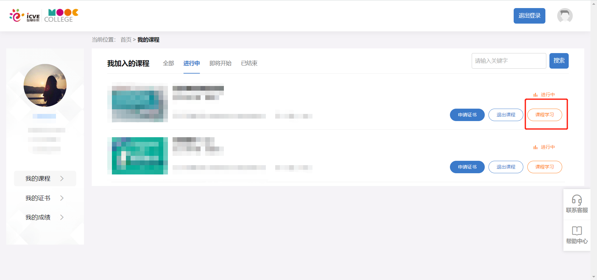

## 准备

- 可上网的浏览器
- 账号密码

## 开始

### Step 1: 打开浏览器进入，选择任意一门课程，点击【课程学习】并观看任意一个视频
https://mooc.icve.com.cn/learning/u/student/student/mooc_index.action

---

### Step 2: 将value部分复制出来，例如 `658d79a0ee1711eb4dd77f79f231679cc5fd563f` 注意是没有单引号的
> `await cookieStore.get('acw_sc__v2')` 或 `(await cookieStore.get('acw_sc__v2')).value`

> 注意：只有拖动视频进度条或者等待时间长一点，才会触发此cookie的生成，是后台提交学习记录后出现的
> 
> 如果失效了需要重新复制此值
> 
> 刷课时请不要用浏览器或其他程序登录，确保刷课稳定
> 
> 

