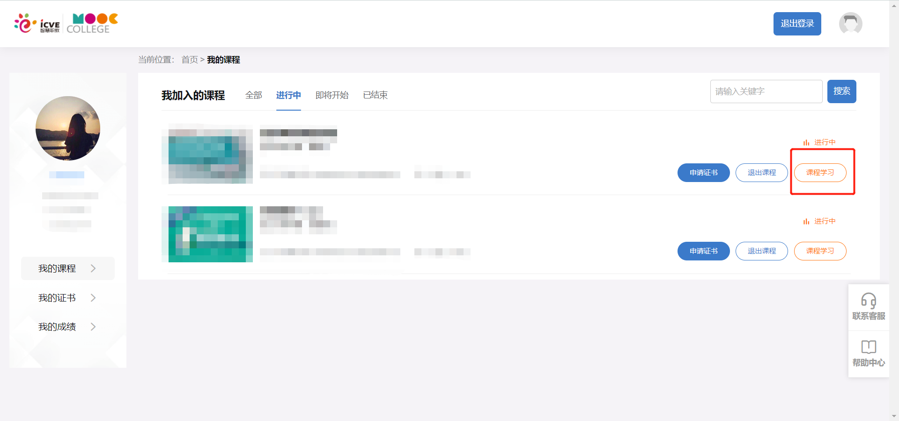
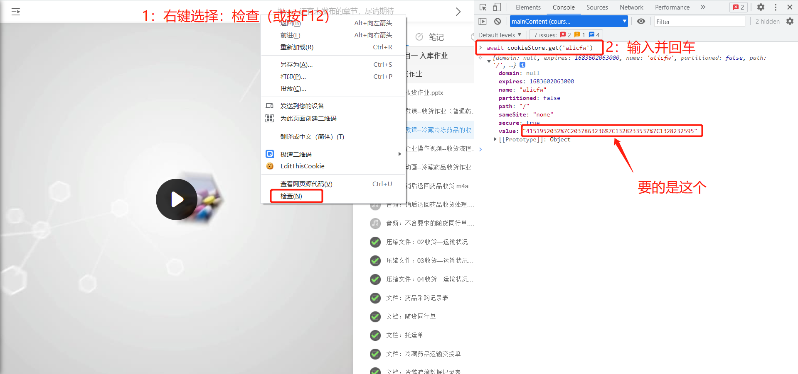

## 准备

- 可上网的浏览器
- 账号密码

## 开始

### Step 1: 打开浏览器进入，选择任意一门课程，点击【课程学习】
https://mooc.icve.com.cn/learning/u/student/student/mooc_index.action

---

### Step 2: 将value部分复制出来，例如 `4151952032%7C2037863236%7C1328233537%7C1328232595` 注意是没有单引号的
> `await cookieStore.get('alicfw')` 或 `(await cookieStore.get('alicfw')).value`

> 注意：只有出现拦截时才会出现这个值
> 
> 24小时有效，超过时间需要重新复制此值
> 
> __如填入后还是提示需要输入，请网页退出登录账号并重新登陆，重新获取alicfw__

