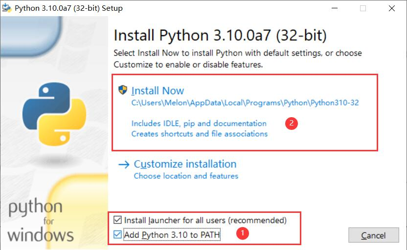
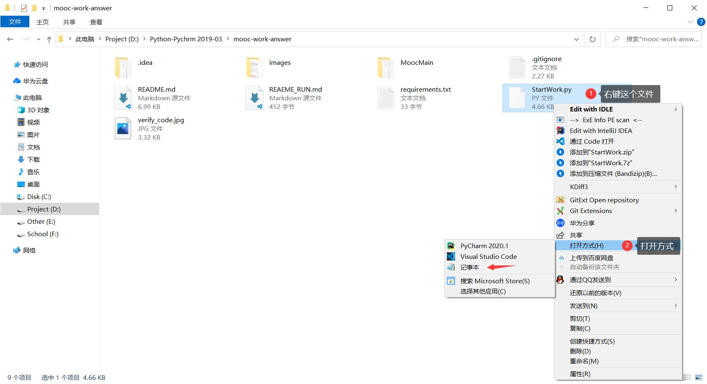
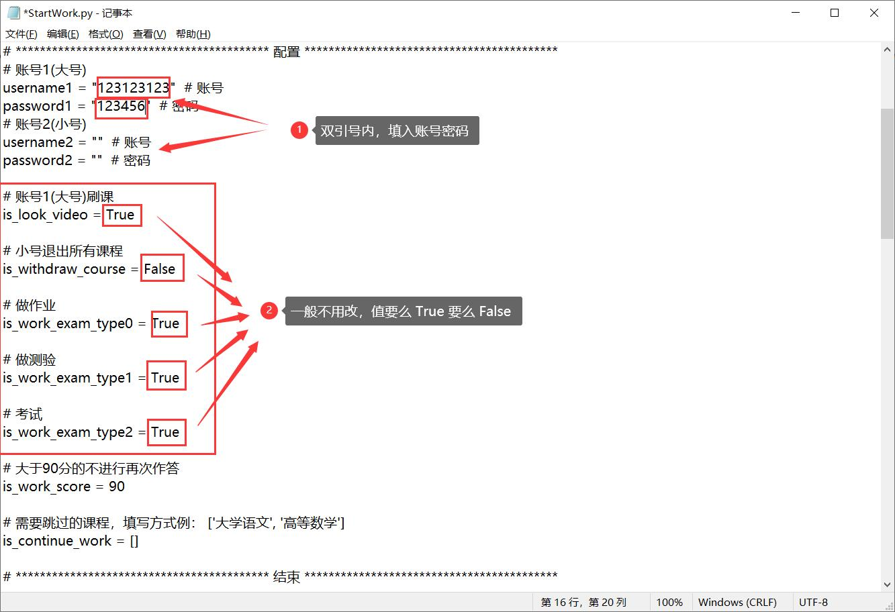
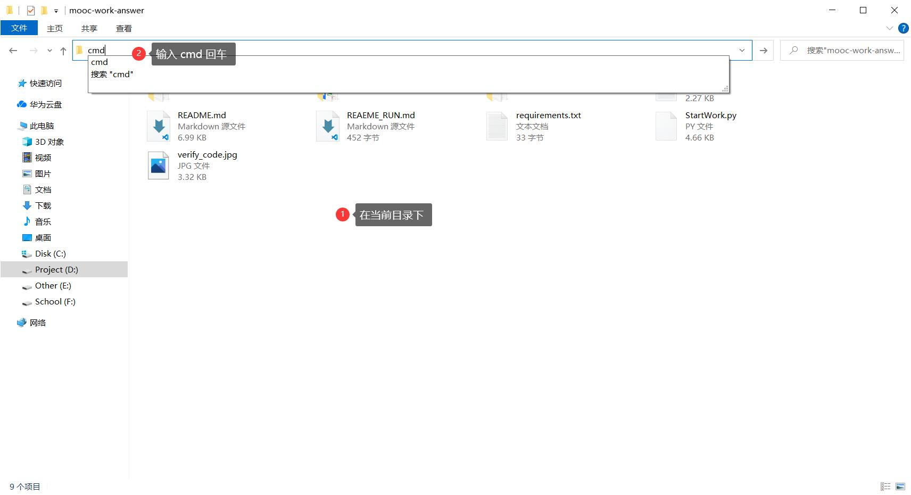
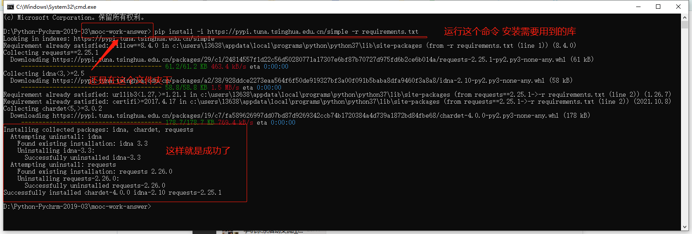
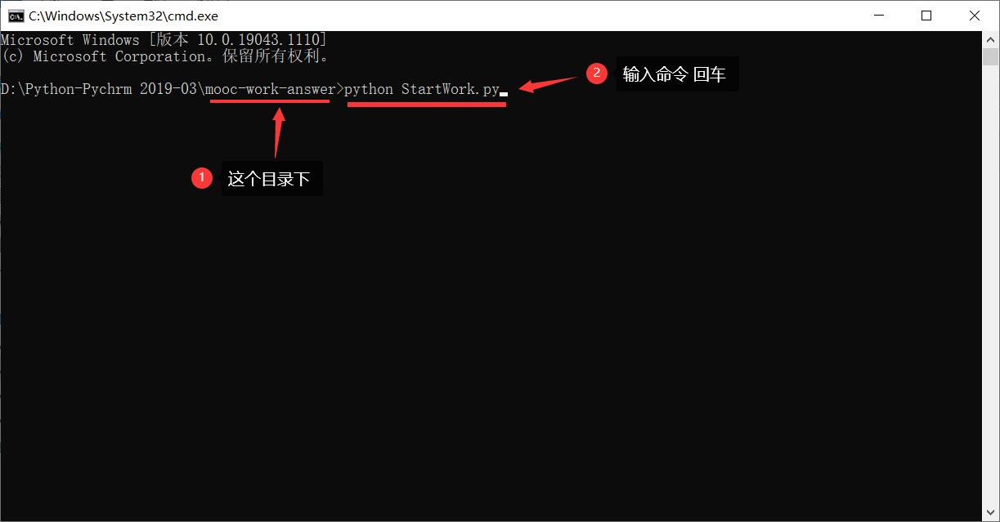
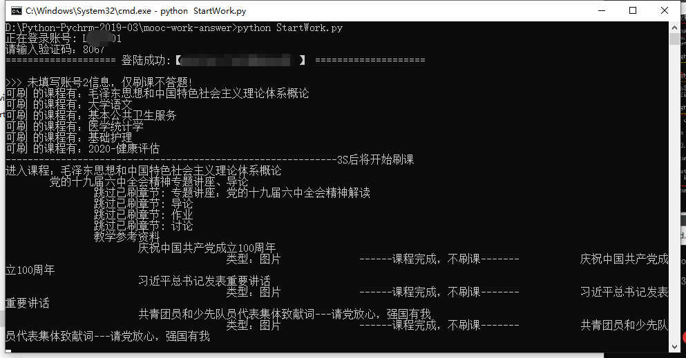

## 环境

- Windows 7
- Windows 10
- Windows 11

## 准备软件

- 32 位电脑下载: [Python 3.7.12 - Sept. 4, 2021 (32-bit)](https://www.python.org/ftp/python/3.10.0/python-3.10.0a7.exe)
- 64 位电脑下载: [Python 3.7.12 - Sept. 4, 2021 (64-bit)](https://www.python.org/ftp/python/3.10.0/python-3.10.0a7-amd64.exe)

## 开始安装

### Step 1: 安装 Python

---

### Step 2: 运行项目

#### Step 2.1: 配置

- **里面的配置看需求改**

#### Step 2.2: 运行

